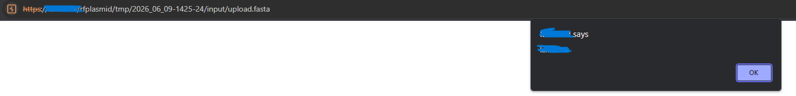

# Fayl Yükləmə Mexanizmindən Stored XSS-ə: Sadə Bir Upload Funksiyasının Təhlükəsizlik Analizi

> Bu writeup dünya üzrə tanınmış universitetlərdən birinin tədqiqat platformasında aşkar etdiyim və Responsible Disclosure prosesi ilə bildirdiyim təhlükəsizlik zəifliyinin texniki analizidir. Məxfilik səbəbindən qurumun adı, domeni və digər identifikasiyaedici məlumatlar paylaşılmır.

---

# Giriş

Bəzən ən ciddi təhlükəsizlik problemləri mürəkkəb Authentication Bypass və ya Remote Code Execution olmur.

Sadəcə istifadəçi tərəfindən yüklənən faylın düzgün emal edilməməsi kifayət edir.

Bu araşdırmanın məqsədi upload mexanizmini analiz etmək idi. İlk baxışdan sistem yalnız müəyyən biologiya fayllarını qəbul edirdi və hər şey normal görünürdü.

Amma təhlükəsizlik testlərində əsas sual həmişə budur:

> "İstifadəçi gözlənilməyən bir fayl yükləsə nə baş verər?"

---

# Upload funksiyasının analizi

İlk olaraq upload request-i Burp Suite vasitəsilə intercept etdim.

Request üzərində dəyişiklik etdikdən sonra serverin fayl uzantısını ciddi şəkildə yoxlamadığını müşahidə etdim.

Bu mərhələdə server-side kod icrası ehtimalını yoxlamaq məqsədilə müxtəlif təhlükəsiz test faylları göndərdim.

Fayllar problemsiz şəkildə upload olunur və serverdə saxlanılırdı.

Lakin sonrakı analiz göstərdi ki, server həmin faylları execute etmir.

Onlar yalnız statik məzmun kimi təqdim olunurdu.

Beləliklə server-side execution mümkün deyildi və diqqətimi faylların istifadəçiyə necə təqdim olunmasına yönəltdim.

---

# Maraqlı hissə

Daha sonra çox sadə HTML faylı upload etdim.

```html
<script>alert(document.domain)</script>
```

Upload problemsiz tamamlandı.

Sistem nəticələri ayrıca qovluqda təqdim edirdi.

Həmin qovluqdakı upload edilmiş fayla klik etdikdə gözlənilməz nəticə ilə qarşılaşdım.

Brauzer faylı download etmədi.

Əksinə HTML kimi render etdi.

Bir neçə saniyə sonra ekranda

```
alert(document.domain)
```



işə düşdü.

Bu artıq Stored Cross-Site Scripting idi.

Çünki payload serverdə saxlanılır və sonradan həmin faylı açan istifadəçilərin brauzerində avtomatik icra olunurdu.

---

# Riskin qiymətləndirilməsi

Stored XSS artıq kifayət qədər ciddi idi.

Lakin araşdırma zamanı daha bir problem diqqətimi çəkdi.

Sessiya cookie-lərində **HttpOnly** atributu istifadə olunmurdu.

Bu isə XSS-in təsirini əhəmiyyətli dərəcədə artırırdı.

Teorik olaraq JavaScript vasitəsilə

```javascript
document.cookie
```

oxunması mümkün idi.

Bu aşağıdakı riskləri yaradırdı.

- Session Hijacking
- Credential Phishing
- Defacement
- İstifadəçi adından əməliyyatların icrası

---

# Problemin səbəbi

Əsas problem upload hissəsində deyildi.

Problem serverin upload edilmiş faylları HTML kimi render etməsində idi.

İstifadəçi tərəfindən yüklənən məzmun

- HTML kimi göstərilir
- təhlükəsiz Content-Type istifadə olunmur
- Content-Disposition tətbiq edilmir
- ayrıca sandbox domeni istifadə edilmir

Bu səbəbdən Stored XSS yaranırdı.

---

# Tövsiyə olunan həllər

## Content-Disposition

```
Content-Disposition: attachment
```

---

## Content-Type

```
Content-Type: text/plain
```

---

## Upload Domain Separation

İstifadəçi məzmunu əsas domen əvəzinə ayrıca sandbox domenindən təqdim olunmalıdır.

---

## HttpOnly

Sessiya cookie-lərində HttpOnly atributu aktiv edilməlidir.

---

# Nəticə

Bu araşdırma göstərdi ki, upload mexanizmlərində əsas təhlükə yalnız faylın qəbul edilməsində deyil.

Əsas risk həmin faylın sonradan istifadəçiyə necə təqdim olunmasındadır.

Sadə görünən upload funksiyası düzgün təhlükəsizlik tədbirləri görülmədikdə yüksək təsirli Stored Cross-Site Scripting zəifliyinə çevrilə bilər.

Responsible Disclosure çərçivəsində zəiflik aidiyyəti üzrə bildirildi və təhlükəsizliyin artırılması üçün texniki tövsiyələr təqdim olundu.

---

## Timeline

- Vulnerability Discovery
- Technical Verification
- Responsible Disclosure
- Vendor Validation
- Hall of Fame Recognition

---

## Lessons Learned

- Upload filtrinin olması kifayət deyil.
- Faylın necə servis edilməsi daha vacibdir.
- Content-Type təhlükəsizliyi kritik rol oynayır.
- HttpOnly XSS təsirini əhəmiyyətli dərəcədə azaldır.
- User Generated Content mümkün qədər ayrıca domen üzərindən təqdim olunmalıdır.

---

**Author**

Mehdi Kerimov

Cybersecurity Researcher
